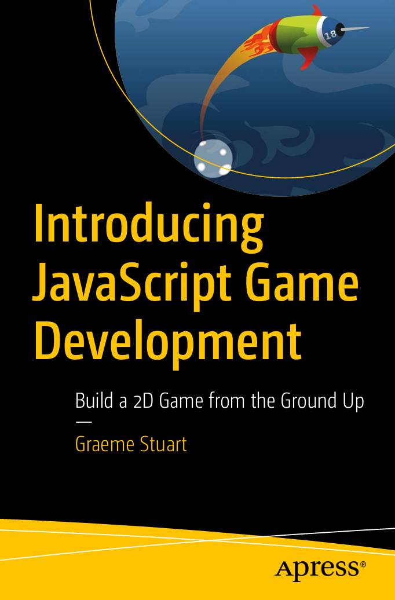

# JavaScriptGameDevelopment

## 📘Reference

    
Introducing JavaScript Game Development

## 📖Table of Contetns
Part I: Drawing 
- Chapter 1:  HTML5 and the Canvas Element 
  - HTML Primer 
  - Drawing to the Canvas 
  - Style the Page to Highlight the Canvas 
  - Experiment with fillStyle 
  - Rendering Text 
  - More Shapes and Lines 
Summary
- Chapter 2:  Understanding Paths 
  - Organizing Your Files 
  - The Canvas Grid System 
  - Refactor Early, Refactor Often 
  - Working with Paths 
  - Adding Curves to a Path 
  - Summary
- Chapter 3:  Drawing to a Design 
  - Pac-Man 
  - Create a Function 
  - Randomization 
  - Summary
- Chapter 4:  Drawing a Spaceship 
  - Basic Trigonometry 
  - A Basic Ship 
  - Using Object Literals 
  - Transforming the Canvas Context 
  - Adding Some Curves 
  - Summary
- Chapter 5:  Drawing an Asteroid 
  - Drawing Basic Shapes 
  - Storing Shape Data 
  - Summary

Part II: Animation
- Chapter 6:  Basic Animation 
  - Start Simple 
  - A More Complicated Example 
  - Summary
- Chapter 7:  Animating Asteroids 
  - A Solid Game Loop 
  - Refactoring into Simple Objects 
  - Using Object Constructors 
  - Extending the Asteroid Prototype 
  - Working with Multiple Asteroids 
  - Summary
- Chapter 8:  Practicing Objects 
  - Why Objects? 
  - Pac-Man Chased by Ghosts 
  - The PacMan object 
  - The Ghost Object 
  - Summary
- Chapter 9:  Inheritance 
  - Set Up a Template 
  - Newton’s Laws of Motion 
  - A General-Purpose Mass Class 
  - A Simple Approach to Inheritance 
  - Asteroids 
  - The Ship 
  - Summary

Part III: Building the Game 
- Chapter 10:  Simple Keyboard Interaction 
  - Controlling Pac-Man 
  - Summary
- Chapter 11:  Controlling the Ship 
  - Thruster Control 
  - Steering
  - Shooting 
  - Summary
- Chapter 12:  Collision Detection 
  - A Quick Refactor 
  - Ship vs
  - Taking Damage 
  - Asteroid vs
  - Summary
- Chapter 13:  Death or Glory 
  - Game Over 
  - Restarting the Game 
  - Implementing Levels 
  - Summary